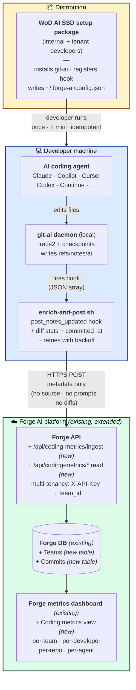
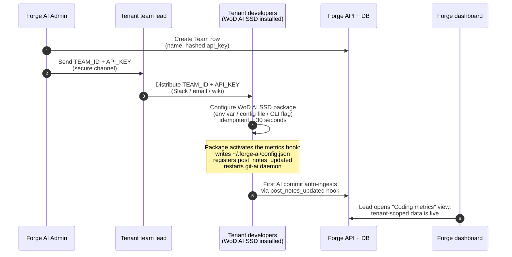

# Forge AI Metrics — Coding Metrics Extension

*Deck-style overview for the technical team. One section per slide.*

This document describes how we extend our existing **Forge AI platform** (API, DB, metrics dashboard) and our existing **WoD AI SSD** developer setup package to capture **AI coding-attribution** metrics from every developer machine — internal and tenant — with a 2-minute setup and zero per-repo configuration.

---

## Slide 1 — The problem

- AI coding agents (Claude, Copilot, Cursor, Codex, …) now author a meaningful share of our committed code
- Leadership wants to know **how much**, **by whom**, **with which agent/model**, **per team and per repo** — for both internal teams and tenant clients
- Existing options either:
  - Live inside one IDE (single-vendor, partial picture), or
  - Require SCM integration / CI changes / per-repo setup — not viable across many tenants and many repos

**We need:** cross-agent, cross-repo visibility with **zero per-repo setup** and **no source code leaving the developer's machine** — and we want it integrated into the platform we already operate, not as a separate product.

---

## Slide 2 — Our solution (extend what we already have)

We **bundle** local capture into our existing developer onboarding package, and **extend** our existing Forge platform to serve the data:

1. **Developer-side capture lives inside the WoD AI SSD setup package** — the same package developers already run for AI workflow setup. It now also installs/upgrades [git-ai](https://usegitai.com), registers a `post_notes_updated` hook, and writes the Forge AI Metrics config. **Zero new install steps for developers — it's part of the bundle.**
2. **Local attribution via [git-ai](https://usegitai.com/docs/cli)'s daemon** — git-ai already attributes every commit to AI prompt IDs vs. human author IDs at line-range granularity. Our hook script reads its output, enriches with diff stats, and posts to the platform.
3. **Ingest + read endpoints are extensions of the existing Forge API** — adds `/api/coding-metrics/ingest` and `/api/coding-metrics/*` read endpoints. Multi-tenancy support is being added to Forge API as a platform-level capability; this feature uses the same `X-API-Key` → `team_id` resolution.
4. **Storage is an extension of the existing Forge DB** — two new tables (`Teams`, `Commits`). Multi-tenant isolation enforced at the application layer (every query filters on `team_id`).
5. **Visualization is an extension of the existing Forge metrics dashboard** — a new "Coding metrics" view next to existing dashboards. Same auth, same tenant scoping, same operational model.

Validated end-to-end across multiple repos in one chat session — three commits to three different repos all flowed through to the dashboard within seconds.

---

## Slide 3 — Architecture diagram



The three layers map to **distribution → capture → platform**, top-to-bottom. Everything in green is reuse-and-extend of what we already operate.

---

## Slide 4 — Data flow (six steps)

1. Developer's AI agent edits files → git-ai's daemon checkpoints the change against a prompt ID
2. Developer runs `git commit` → daemon writes a `refs/notes/ai` note containing the file map (line ranges per prompt or human ID) + a JSON section with prompt metadata (`agent_id.tool`, `agent_id.model`, `human_author`, `accepted_lines`, `overriden_lines`)
3. Daemon dispatches `post_notes_updated` (JSON array of events) → our hook script
4. Script enriches each event with `diff_additions`, `diff_deletions`, `committed_at`; POSTs to the new `/api/coding-metrics/ingest` endpoint on Forge API
5. Forge API authenticates via `X-API-Key` → resolves `team_id` → parses note → computes `ai_lines / human_lines / agent / model / human_author / overridden_lines` → upserts on `(team_id, repo_name, commit_sha)` into the new `Commits` table in Forge DB
6. Forge dashboard's new "Coding metrics" view queries the same Forge DB; data appears within ~3 seconds of commit

**Failure modes are silent-but-logged**: hook stderr is tee'd to `~/.forge-ai/last-run.log`, raw payloads dumped to `~/.forge-ai/last-payload.json`. Never blocks `git commit`.

---

## Slide 5 — Developer local machine (what the package installs)

What ends up on the developer's machine after the WoD AI SSD package runs (or after they configure their tenant key on an already-installed package). All paths are global per-user — no per-repo state, no `.git/hooks/` symlinks.

### Files & directories

```
~/.git-ai/                              ← managed by git-ai itself
├── bin/{git-ai,git,git-og}              git-ai binaries (also wraps `git` on PATH)
├── libexec/git-core/                    trace2 plumbing
├── config.json                          git-ai config (we write hook + flags here)
└── internal/daemon/
    ├── daemon.pid.json · daemon.lock    runtime state
    ├── control.sock · trace2.sock       UNIX sockets for IPC + git event capture
    └── logs/<pid>.log                   structured daemon log

~/.forge-ai/                             ← our package adds these
├── config.json                          tenant config (api_url, api_key, team_id, project_root)
├── enrich-and-post.sh                   the post_notes_updated hook script
├── last-run.log                         stderr from each hook run (diagnosis)
└── last-payload.json                    most recent raw daemon payload (diagnosis)
```

### Configuration written

- `~/.git-ai/config.json` — set by the package via `git-ai config set …`:
  - `git_ai_hooks.post_notes_updated` → `~/.forge-ai/enrich-and-post.sh`
  - `feature_flags.async_mode` → `true` *(pinned defensively against future default flips)*
  - `prompt_storage` → `local`
  - We deliberately **do not** touch `feature_flags.git_hooks_enabled` — that flag controls git-ai's *native-git-hooks* subsystem (`git-ai install-hooks`, `.git/hooks/*` editor wrappers), not the daemon's internal `git_ai_hooks.*` dispatch we rely on. Verified empirically 2026-04-29.
- `~/.gitconfig` (global) — set by the upstream git-ai installer, **not** per-repo:
  - `trace2.eventtarget` → `af_unix:stream:.../trace2.sock`
  - `trace2.eventnesting` → `10`
- **No per-repo `.git/hooks/` symlinks. No `core.hooksPath` modifications.** This is what makes the setup zero-friction across N repos.

### Hooks registered

- `git_ai_hooks.post_notes_updated` — fires inside the git-ai daemon **after** it writes a `refs/notes/ai` note for the just-finished commit. Payload arrives as JSON on stdin (an array of one event per just-written note).

### Background services

- **git-ai daemon** — long-lived background process, controlled via `git-ai bg start/stop/restart/status`. Owns the trace2 socket. Caches `~/.git-ai/config.json` in memory at startup, so the package restarts it after writing config.

### System dependencies

| Tool | Purpose | How the package handles it |
|---|---|---|
| `curl`, `git` | baseline | refused if missing — developer must install |
| `jq` | parsing hook payloads | auto-installed via `brew` / `apt` / `dnf` / `yum` / `pacman` / `apk` |
| `git-ai` 1.3.4+ | local attribution daemon | auto-installed via official installer at [https://usegitai.com/docs/cli](https://usegitai.com/docs/cli) |
| Active integrated AI agent | source of attribution events | Claude Code CLI/extension or Copilot extension *(verified working — see Slide 9)* |

### Inputs the package needs (from admin / detection)

| Input | Source | Stored in |
|---|---|---|
| `TEAM_ID` (UUID) | Forge AI Admin → tenant lead | `~/.forge-ai/config.json` |
| `API_KEY` (e.g. `acme_<random>`) | Forge AI Admin → tenant lead | `~/.forge-ai/config.json` *(plain text locally; hashed server-side)* |
| `api_url` | Package default per environment | `~/.forge-ai/config.json` |
| `project_root` | Auto-detected (`~/Projects` → `~/Code` → `~/work` → `~/src` → `~/dev`); override with `FORGE_PROJECT_ROOT=...` | `~/.forge-ai/config.json` |
| OS | Detected at install time | macOS · Linux · Windows (Git Bash, less battle-tested) |

The two diagnostic files (`last-run.log`, `last-payload.json`) are the only window into hook behavior — see architecture doc Section 10 for troubleshooting.

---

## Slide 6 — What we collect / what we don't

| ✅ Sent to Forge API | ❌ Never leaves the machine |
|---|---|
| Commit SHA, branch, repo name + URL | Source code |
| File **paths** + line **ranges** (no content) | Prompts / AI responses |
| Agent tool + model (e.g., `claude` / `claude-opus-4-7`) | Full diffs |
| Author name (extracted from git-ai note) | SCM credentials |
| Line counts + diff stats (counts only) | Anything outside the metadata above |

**Tenant isolation:** every row stamped with `team_id`; every query filters on it; the API key resolves to exactly one team. Same pattern Forge platform uses for other multi-tenant endpoints.

---

## Slide 7 — Onboarding pipeline (internal team or external tenant)

The metrics-collection logic ships **inside** the WoD AI SSD package — no external setup URL, no separate installer to host. The developer's normal package install (or update) already includes git-ai install + the hook script + the config writer. Onboarding is purely about **provisioning a tenant key and handing it to developers**.



**Total time admin → first data**: ~10 minutes (admin work) + ~30 seconds per developer (just configuring the key — package is already installed) + the next AI commit. Existing tenants already running the WoD AI SSD package only need to apply their tenant key — no re-install.

---

## Slide 8 — Worked example: what one commit looks like in the database

A real ingested commit from a multi-repo Claude Code session — taken from `gitai-service-b`, SHA `ae20f6f29e22293875cbfa6e6252db59360d960a`. Picked because it's the **richest** of the three: mixed AI + human attribution, non-contiguous human line ranges, and `overridden_lines > 0`.

### What the developer did

In one Claude Code session, asked Claude to add fields to `test.json` in three sibling repos (`gitai-workspace`, `gitai-service-a`, `gitai-service-b`). The developer also typed some lines manually. `service-b` ended up with the most mixed file map.

### What landed in `Commits`

| Column | Value |
|---|---|
| `Id` | `738DE4DC-759A-4559-9058-B8F0D1AA7919` |
| `TeamId` | `AD803EFC-A21B-4556-B5B4-3D1B1DEC0C12` *(Platform Team)* |
| `RepoName` | `gitai-service-b` |
| `RepoUrl` | `https://github.com/ShamsiievDmytro/gitai-service-b.git` |
| `CommitSha` | `ae20f6f29e22293875cbfa6e6252db59360d960a` |
| `Branch` | `main` |
| `IsDefaultBranch` | `1` |
| `CommitAuthor` | `Dmytro Shamsiiev` *(extracted from `prompts.<id>.human_author`)* |
| `Agent` | `claude` |
| `Model` | `claude-opus-4-7` |
| `AgentLines` | `2` |
| `HumanLines` | `10` |
| `OverriddenLines` | `1` *(human modified an AI line)* |
| `AgentPercentage` | `16.7` |
| `DiffAdditions` | `12` *(enriched: `git diff --numstat`)* |
| `DiffDeletions` | `1` *(enriched)* |
| `CommittedAt` | `2026-04-29 08:55:05` *(enriched: `git log -1 --format=%aI`)* |
| `IngestedAt` | `2026-04-29 08:55:08.047` *(server)* |
| `RawNote` | *(see below — full git-ai note stored verbatim for replay)* |

### `RawNote` — verbatim git-ai output stored for forward-compatibility

```
test.json
  h_dca485b1adf836 3-4,7-14
  d4a7828bfdafe456 5-6
---
{
  "schema_version": "authorship/3.0.0",
  "git_ai_version": "1.3.4",
  "base_commit_sha": "ae20f6f29e22293875cbfa6e6252db59360d960a",
  "prompts": {
    "d4a7828bfdafe456": {
      "agent_id": { "tool": "claude", "model": "claude-opus-4-7" },
      "human_author": "Dmytro Shamsiiev",
      "total_additions": 3, "total_deletions": 1,
      "accepted_lines": 2, "overriden_lines": 1
    }
  },
  "humans": { "h_dca485b1adf836": { "author": "Dmytro Shamsiiev" } }
}
```

### How the columns are derived

| Derived column | Source | Computation |
|---|---|---|
| `AgentLines = 2` | file map | sum of ranges for prompt id `d4a7828b…` → lines 5-6 |
| `HumanLines = 10` | file map | sum of ranges for human id `h_dca485b1…` → lines 3-4 (2) + 7-14 (8) = 10 |
| `AgentPercentage = 16.7` | computed | 2 / (2 + 10) × 100 |
| `OverriddenLines = 1` | prompts JSON | `prompts.d4a7828b….overriden_lines` *(note the git-ai 1.3.4 spelling)* |
| `Agent / Model` | prompts JSON | joined from contributing prompt ids: `claude` / `claude-opus-4-7` |
| `CommitAuthor` | prompts JSON | `prompts.<id>.human_author` (top-level payload has no author field — extracted server-side) |
| `DiffAdditions / Deletions` | enrichment | `git diff --numstat ae20f6f2^!` — 12 added, 1 deleted |
| `CommittedAt` | enrichment | `git log -1 --format=%aI ae20f6f2` — ISO 8601 with timezone |

This is exactly what the Forge dashboard's "Coding metrics" view will read for every per-team / per-developer / per-repo / per-agent rollup.

---

## Slide 9 — Status & validation

**What's verified working today** (with git-ai 1.3.4 and Forge AI Metrics v1):

| Agent | Status |
|---|---|
| Claude Code (CLI) | ✅ Working — fully attributed, multi-repo verified |
| Claude Code (VS Code ) | ✅ Working |
| GitHub Copilot (VS Code extension) | ✅ Working |
| Cursor | ⏳ Blocked on git-ai upstream — see [issue #1204](https://github.com/git-ai-project/git-ai/issues/1204) |
| Codex | ⏳ Blocked on git-ai upstream — see [issue #1204](https://github.com/git-ai-project/git-ai/issues/1204) |

**Pipeline-level validation:**

- ✅ End-to-end across **6+ repos** on one developer machine, single Claude Code session → one row per repo per commit, all attributed correctly
- ✅ Forge API extension hardened: BadRequest on missing fields, null-guard parser, `human_author` extracted from note (top-level payload doesn't carry it)
- ✅ Hook script handles JSON array payload (undocumented in [usegitai.com docs](https://usegitai.com/docs/cli) — confirmed via binary inspection + live capture); stderr captured to `last-run.log` for diagnosis
- ✅ Package configuration is fully idempotent — re-applying tenant key is the upgrade path for everything (git-ai version, hook script, config drift)
- ✅ Onboarding doc live at `docs/onboarding.md`; deep architecture + troubleshooting at `docs/2026-04-28-forge-ai-metrics-architecture.md` Section 10

**Production readiness:** v1 deployable for Claude (CLI + extension) and Copilot tenants as soon as Forge API multi-tenancy lands. Cursor and Codex coverage activates automatically the moment git-ai upstream ships the fix in [#1204](https://github.com/git-ai-project/git-ai/issues/1204) — no changes needed on our side. Other open items are tracked in Section 9 of the architecture doc (squash/rebase reconciliation, multi-agent conflict).

---

## Slide 10 — What we ask for

- ✋ **Sign-off on the integration shape** — coding-metrics endpoints living inside Forge API, tables living inside Forge DB, view living inside Forge dashboard, capture logic bundled in the WoD AI SSD package. Nothing standalone.
- 📅 **Timeline visibility on Forge API multi-tenancy** — this feature depends on `X-API-Key → team_id` resolution being available platform-wide
- 📦 **Bundling alignment with the WoD AI SSD package owners** — git-ai install + hook registration becomes part of the standard package; tenant key configured per-developer via env var / config / CLI flag
- 🛣️ **Pilot tenant** — pick one internal team to onboard first; ~30 min admin work + a Slack message to their devs
- 👀 **Watch git-ai [#1204](https://github.com/git-ai-project/git-ai/issues/1204)** — once merged, Cursor and Codex coverage lights up automatically for every tenant already on the package

Questions / pushback welcome.
