# Forge AI Metrics — Architecture at a glance

> 1-page summary for fast review. Full deck: [`forge-architecture-overview.md`](./forge-architecture-overview.md) · Deep dive: [`ai-code-metrics-architecture.md`](./ai-code-metrics-architecture.md)

**Goal:** Cross-agent visibility into how much committed code came from AI agents (Claude · Copilot · Cursor · Codex · …) — with **zero per-repo setup**, **no source code leaving the developer's machine**, and **integrated into the platform we already operate** (no separate product).

```mermaid
flowchart TB
    subgraph DIST["📦 Distribution"]
        SSD["<b>WoD AI SSD setup package</b><br/>(internal + tenant developers)<br/>installs git-ai · registers hook<br/>activates on TEAM_ID + API_KEY config<br/>🔧 <b>custom</b> (extend existing package)"]
    end

    subgraph DEV["💻 Developer machine"]
        direction TB
        AGENT["<b>AI coding agent</b><br/>Claude · Copilot · Continue · …<br/>🧩 <b>OOTB</b>"]
        GITAI["<b>git-ai daemon</b> (local)<br/>trace2 + checkpoints · writes refs/notes/ai<br/>🧩 <b>OOTB</b> (3rd party · usegitai.com)"]
        HOOK["<b>enrich-and-post.sh</b><br/>post_notes_updated hook<br/>+ diff stats + retries<br/>🔧 <b>custom</b> (~95 lines bash)"]
        AGENT -- "edits files" --> GITAI
        GITAI -- "fires hook<br/>(JSON array)" --> HOOK
    end

    subgraph FORGE["☁️ Forge AI platform <i>(existing, extended)</i>"]
        direction TB
        API["<b>Forge API</b><br/>+ /api/coding-metrics/* <i>(new — ingest + read)</i><br/>multi-tenancy: X-API-Key → team_id<br/>🔧 <b>custom</b> (extend existing API)"]
        DB[("<b>Forge DB</b> <i>(existing)</i><br/>+ Commits <i>(new table)</i><br/>🔧 <b>custom</b> (extend existing DB)")]
        UI["<b>Forge metrics dashboard</b> <i>(existing)</i><br/>+ Coding metrics view <i>(new)</i><br/>per-team · per-developer · per-repo · per-agent<br/>🔧 <b>custom</b> (extend existing dashboard)"]
        API --> DB
        DB --> UI
    end

    SSD ==>|"developer runs<br/>once · 2 min · idempotent"| DEV
    HOOK ==>|"HTTPS POST<br/>metadata only<br/>(no source · no prompts · no diffs)"| API

    classDef dist fill:#fef3c7,stroke:#92400e,stroke-width:2px,color:#000
    classDef dev fill:#dbeafe,stroke:#1e40af,stroke-width:2px,color:#000
    classDef forge fill:#dcfce7,stroke:#14532d,stroke-width:2px,color:#000
    class DIST dist
    class DEV dev
    class FORGE forge
```

🧩 **OOTB** = out-of-the-box · third-party or existing platform component · **no work needed** &nbsp; · &nbsp; 🔧 **custom** = our scope · either net-new code or an extension to an existing component

## Reuse vs build

| 🧩 Reuse (out-of-the-box) | 🔧 Build (custom) |
|---|---|
| AI coding agents — Claude, Copilot, Continue (Cursor + Codex once git-ai [#1204](https://github.com/git-ai-project/git-ai/issues/1204) ships) | `enrich-and-post.sh` — ~95-line bash hook that ships with the package |
| **git-ai** daemon — third-party local attribution engine ([usegitai.com](https://usegitai.com/docs/cli)) | Bundle git-ai install + hook + config writer into existing **WoD AI SSD** package |
| Existing **Forge API**, **Forge DB**, **Forge metrics dashboard** infrastructure | New `/api/coding-metrics/*` endpoints on Forge API (1 ingest + 4 read) |
| Existing tenant provisioning process (yields `TEAM_ID` + `API_KEY`) | New `Commits` table in existing Forge DB |
| | New "Coding metrics" view in existing Forge dashboard |

## Status

- ✅ End-to-end validated · Claude Code (CLI + VS Code/JetBrains extension) and GitHub Copilot working today
- ⏳ Cursor + Codex coverage activates automatically once git-ai [#1204](https://github.com/git-ai-project/git-ai/issues/1204) ships — no changes on our side
- 📅 Production deploy gated on Forge API multi-tenancy work (in flight)
- 🚫 **Blocker — API-key endpoint protection.** The new `/api/coding-metrics/*` endpoints currently rely on a single `X-API-Key` check resolving to a `team_id`. Production-grade protection (rate limiting, key rotation, audit logging, anti-abuse / brute-force defenses, transport hardening beyond HTTPS) is **not** yet in place — it depends on the Forge platform's standard API-gateway / auth capabilities being applied to these endpoints before any external tenant goes live.
